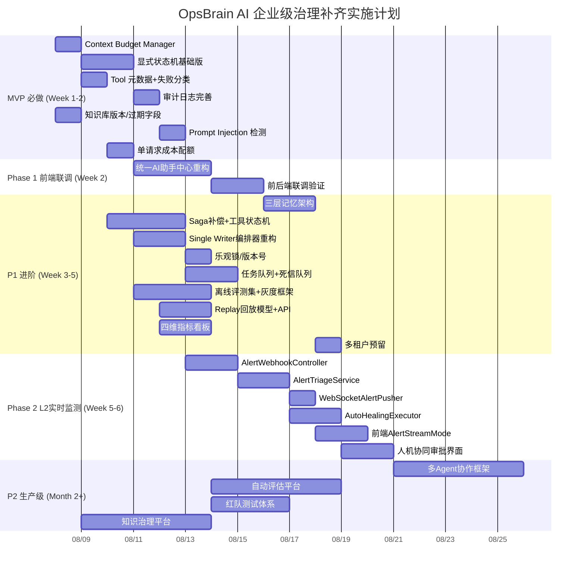

# OpsBrain AI 企业级 Agent 方法论对标分析报告

> **生成时间**：2026-08-08  
> **分析对象**：OpsBrain AI（智维大脑）当前 L1 被动问答阶段实现  
> **对标基准**：Agent Methodology 企业级 Agent 开发总纲与核心风险文档  
> **分析目的**：识别当前实现的差距，制定可行性修复设计建议与阶段步骤规划

---

## 一、总体对标结论

| 维度 | 当前成熟度等级 | 目标等级 | 差距评估 |
| :--- | :---: | :---: | :--- |
| **业务边界与风险分级** | Level 1 (工程雏形) | Level 2 (受治理系统) | ⚠️ 部分缺失 |
| **数据与知识治理** | Level 2 | Level 2 | ✅ 基本达标 |
| **上下文与记忆防护** | Level 1 | Level 2 | ⚠️ 仅实现滑动窗口 |
| **Tool Runtime 治理** | Level 2 | Level 2 | ✅ 基本达标 |
| **流程与状态一致性** | Level 1 | Level 2 | ⚠️ 缺失显式状态机 |
| **观测、审计、回放** | Level 1 | Level 2 | ⚠️ 仅基础日志 |
| **持续评估机制** | Level 0 | Level 2 | ❌ 完全缺失 |
| **版本化与变更治理** | Level 0 | Level 2 | ❌ 完全缺失 |
| **成本与性能治理** | Level 1 | Level 2 | ⚠️ 仅语义缓存 |
| **合规与组织治理** | Level 0 | Level 2 | ❌ 完全缺失 |

**整体评估**：OpsBrain AI 目前处于 **Level 1.5（工程雏形 → 受治理系统过渡期）**，核心 RAG + Agent 编排已跑通，但**治理层、运营层、评估层**显著缺失，需补齐才能达到企业级试运行标准。

---

## 二、核心差距详细清单（按 Agent Methodology 16 大风险面对标）

### 1. 幻觉风险 — ⚠️ 部分缺失
| 方法论要求 | 当前实现 | 差距 |
| :--- | :--- | :--- |
| 四层防护（L1-L4） | ✅ 已实现 | — |
| 证据溯源强制化 | ✅ Prompt 约束 + citations 回传 | — |
| **事实优先级引擎** | ❌ 缺失 | **无多源证据仲裁，仅依赖 Prompt** |
| **动态证据包注入** | ❌ 缺失 | **仅静态知识库检索，无运行时实时数据融合** |

### 2. 越权执行风险 — ✅ 基本达标
| 方法论要求 | 当前实现 | 差距 |
| :--- | :--- | :--- |
| 工具白名单 | ✅ 仅 2 个 @Tool | — |
| 参数 Schema 校验 | ✅ ToolParameterValidator | — |
| 高风险操作审批 | ⚠️ 仅工单创建，无分级审批 | **L2 阶段需补** |
| 权限边界（多租户/角色） | ❌ 缺失 | **单租户硬编码 creator/assignee** |

### 3. 记忆风险 — ⚠️ 仅热记忆
| 方法论要求 | 当前实现 | 差距 |
| :--- | :--- | :--- |
| 三层记忆架构 | ⚠️ 仅 Redis 会话 + 滑动窗口 | **缺温记忆（摘要/事实）与冷记忆（归档）** |
| Context Budget Manager | ❌ 缺失 | **无预算控制，依赖模型截断** |
| 关键事实蒸馏 | ❌ 缺失 | **会话不产出结构化摘要** |
| 串话隔离 | ✅ traceId 隔离 | — |

### 4. 上下文爆炸风险 — ❌ 缺失预算管理
| 方法论要求 | 当前实现 | 差距 |
| :--- | :--- | :--- |
| Context Budget Manager | ❌ 无 | **必须补齐** |
| 摘要压缩策略 | ❌ 无 | **需设计** |
| 证据 Rerank + TopN | ✅ HybridRetriever topK | — |
| 显式降级提醒 | ❌ 无 | **超预算时无用户感知** |

### 5. 工具半残风险 — ⚠️ 部分缺失
| 方法论要求 | 当前实现 | 差距 |
| :--- | :--- | :--- |
| Tool 元数据完整 | ⚠️ 仅参数校验 | **缺 timeout/retries/幂等/补偿/审批/审计字段** |
| 失败分类标准化 | ❌ 仅 catch Exception | **需分类：参数/权限/超时/限流/服务不可用/部分成功** |
| 幂等键设计 | ⚠️ 工单 Redis INCR | **仅工单有，通用框架无** |
| Saga 补偿机制 | ❌ 完全缺失 | **多步骤工具链无补偿** |
| 工具状态机 | ❌ 无 | **需补充 PENDING→RUNNING→SUCCESS/FAILED→COMPENSATING** |

### 6. 并发打架风险 — ⚠️ 仅工单序号有锁
| 方法论要求 | 当前实现 | 差距 |
| :--- | :--- | :--- |
| Single Writer 原则 | ❌ 无显式架构约束 | **Agent 直接写工单，无编排器控制** |
| 乐观锁/CAS | ❌ 无 | **实体无 version 字段** |
| 任务队列/死信队列 | ❌ 无 | **异步仅用 CompletableFuture，无持久化队列** |

### 7. 状态漂移风险 — ❌ 核心缺失
| 方法论要求 | 当前实现 | 差距 |
| :--- | :--- | :--- |
| 显式状态机 | ❌ 无 | **Agent 流程仅靠 Prompt 串联，无状态机** |
| 状态推进可视化 | ❌ 无 | **前端仅见 token 流，不见工具/步骤状态** |
| 断点恢复 | ❌ 无 | **会话中断不可恢复** |
| 模型输出与数据库一致性校验 | ❌ 无 | **toolResults 仅回传前端，不落库对账** |

### 8. 注入污染风险 — ⚠️ 仅安全门卫
| 方法论要求 | 当前实现 | 差距 |
| :--- | :--- | :--- |
| 外部文本非可信标记 | ❌ 无 | **知识库文档/工单描述直进上下文** |
| Prompt Injection 检测 | ❌ 无 | **需增加检测层** |
| 参数二次校验 | ✅ ToolParameterValidator | — |

### 9. 数据过期风险 — ⚠️ 缺失版本与过期机制
| 方法论要求 | 当前实现 | 差距 |
| :--- | :--- | :--- |
| 知识版本号 | ❌ sys_knowledge_chunk 无 version | **无法区分新旧版本** |
| 生效/失效时间 | ❌ 无 | **过期文档继续被检索** |
| 作废标记 | ❌ 无 | **无法软删除** |
| 增量更新机制 | ✅ KnowledgeIngestionService.reload | **仅全量/增量，无版本对比** |

### 10. 评估失真风险 — ❌ 完全缺失
| 方法论要求 | 当前实现 | 差距 |
| :--- | :--- | :--- |
| 离线评测集 | ❌ 无 | **必须建立** |
| 灰度评估 | ❌ 无 | **无 A/B 能力** |
| 在线抽检/人工打分 | ❌ 无 | **无反馈闭环** |
| 质量指标看板 | ❌ 无 | **Dashboard 仅统计，无质量指标** |

### 11. 可观测性不足 — ⚠️ 仅基础链路
| 方法论要求 | 当前实现 | 差距 |
| :--- | :--- | :--- |
| Trace 链路完整 | ✅ traceId 全链路 | — |
| 完整审计字段 | ⚠️ 仅基础字段 | **缺 operation_type/affected_resources/operator_id** |
| Replay 回放能力 | ❌ 无 | **无法还原完整会话上下文/证据/工具链路** |
| 线上指标体系 | ❌ 无 | **缺质量/运行/运营/风险四维指标** |

### 12. 不可回滚风险 — ❌ 完全缺失
| 方法论要求 | 当前实现 | 差距 |
| :--- | :--- | :--- |
| 版本化发布 | ❌ 无 | **Prompt/模型/知识/策略无版本** |
| 灰度开关 | ❌ 无 | **全量生效** |
| 一键回滚 | ❌ 无 | **变更不可逆** |
| Kill Switch | ❌ 无 | **无紧急熔断总开关** |

### 13. 成本失控风险 — ⚠️ 仅语义缓存
| 方法论要求 | 当前实现 | 差距 |
| :--- | :--- | :--- |
| 小模型优先路由 | ✅ DevOpsIntentRouter | — |
| 语义缓存 | ✅ SemanticCacheService | — |
| Token 预算与成本上限 | ❌ 无 | **无单请求/单日/单用户成本配额** |
| 模板化/摘要化高频场景 | ❌ 无 | **所有场景均走大模型** |

### 14. 延迟失控风险 — ⚠️ 仅流式输出
| 方法论要求 | 当前实现 | 差距 |
| :--- | :--- | :--- |
| 阶段 Deadline | ❌ 无 | **无超时预算控制** |
| 并行检索/只读查询 | ❌ 串行 | **路由→引擎→工具全串行** |
| 慢 Tool 异步化 | ❌ 无 | **工具执行阻塞流式回调线程** |
| 流式输出体感 | ✅ SSE TokenStream | — |

### 15. 治理断档风险 — ❌ 完全缺失
| 方法论要求 | 当前实现 | 差距 |
| :--- | :--- | :--- |
| 线上质量报表 | ❌ 无 | **无周/月质量复盘机制** |
| 失败案例库 | ❌ 无 | **无事故沉淀** |
| 知识更新失效节奏 | ❌ 无 | **无定期巡检** |
| 值班责任人 | ❌ 无 | **组织治理缺位** |

### 16. 合规伦理风险 — ❌ 完全缺失
| 方法论要求 | 当前实现 | 差距 |
| :--- | :--- | :--- |
| 数据权限边界 | ❌ 单租户 | **多租户隔离未设计** |
| 敏感信息脱敏 | ❌ 无 | **工单/日志可能含密钥/密码** |
| 决策可解释 | ⚠️ 仅 citations | **无结构化推理链路** |
| 高风险不替代专业责任人 | ❌ 无声明 | **工单创建无免责/确认机制** |

---

## 三、优先级修复矩阵（按 MVP→P1→P2 分层）

### 🟢 MVP 必做（立即修复，阻塞 L2 推进）

| # | 修复项 | 对应风险面 | 预估工时 | 核心改动文件 |
| :--- | :--- | :--- | :---: | :--- |
| **MVP-1** | **Context Budget Manager** | 4, 14 | 1 天 | 新建 `ContextBudgetManager.java`，集成 `DevOpsAgentServiceImpl` |
| **MVP-2** | **显式状态机（基础版）** | 7, 10 | 2 天 | 新建 `AgentStateMachine.java`，枚举状态，`DevOpsAgentEngine` 返回结构化状态 |
| **MVP-3** | **Tool 元数据完善 + 失败分类** | 5 | 1 天 | 重构 `DevOpsTools`，引入 `ToolMetadata` 注解/配置类 |
| **MVP-4** | **审计日志完善（含 operation_type 等）** | 11 | 0.5 天 | 扩展 `AgentCallLog` 实体 + `AgentLogService` |
| **MVP-5** | **知识库版本/过期/作废字段** | 9 | 1 天 | `sys_knowledge_chunk` 加列 + `KnowledgeIngestionService` 适配 |
| **MVP-6** | **Prompt Injection 检测层** | 8 | 1 天 | 新建 `PromptInjectionGuard.java`，接入 `SecurityInputGuard` 链路 |
| **MVP-7** | **单请求成本/Token 上限配额** | 13 | 0.5 天 | `DevOpsAgentServiceImpl` 增加预算检查，配置化阈值 |

### 🟡 P1 进阶增强（L2 阶段前完成）

| # | 修复项 | 对应风险面 | 预估工时 | 核心改动 |
| :--- | :--- | :--- | :---: | :--- |
| **P1-1** | **三层记忆架构落地** | 3 | 2 天 | Redis 热记忆（现有）+ PG 温记忆（会话摘要/关键事实表）+ OSS 冷记忆（归档脚本） |
| **P1-2** | **Saga 补偿框架 + 工具状态机** | 5, 6 | 3 天 | 新建 `CompensationManager`、`ToolExecutionStateMachine`，改造 `DevOpsTools` 返回结构化结果 |
| **P1-3** | **Single Writer 编排器重构** | 6, 7 | 2 天 | 新建 `AgentOrchestrator`，`DevOpsAgentEngine` 仅返回建议，编排器落库 |
| **P1-4** | **乐观锁/版本号机制** | 6 | 1 天 | 核心实体加 `version` 字段，Repository 更新时 CAS |
| **P1-5** | **任务队列 + 死信队列（Redis Stream/RabbitMQ）** | 6 | 2 天 | 异步工单创建/通知入队，重试/死信处理 |
| **P1-6** | **离线评测集建设 + 灰度发布框架** | 10, 12 | 3 天 | 测试数据集 JSON，`EvalRunner`，配置中心灰度开关 |
| **P1-7** | **Replay 回放数据模型 + API** | 11 | 2 天 | 新建 `AgentReplaySnapshot` 表，`ReplayController` |
| **P1-8** | **四维线上指标看板** | 11, 13 | 2 天 | 扩展 `DashboardService`，Prometheus/Grafana 或内置 ECharts |
| **P1-9** | **多租户隔离设计（预留字段 + 上下文注入）** | 16 | 1 天 | 实体加 `tenant_id`，`TraceContext` 注入租户 |

### 🔴 P2 生产级增强（L3+ 阶段）

| # | 修复项 | 对应风险面 | 预估工时 | 备注 |
| :--- | :--- | :--- | :---: | :--- |
| **P2-1** | 多 Agent 协作框架 | 11 | 5 天 | Coordinator + Worker 模式 |
| **P2-2** | 自动评估平台 | 10 | 5 天 | 定时跑回归、漂移检测 |
| **P2-3** | 红队测试/故障演练体系 | 8, 15 | 3 天 | Prompt Injection/越权/并发压测 |
| **P2-4** | 知识治理平台 | 9, 15 | 5 天 | 版本对比、过期预警、自动归档 |

---

## 四、结合 AI 入口架构演进方案的联动修复路径

参考 `docs/02-architecture-design/AI入口架构演进方案.md` 推荐的**方案 A（统一 AI 助手中心 + 多模式）**，前端重构与后端治理能力需同步演进：

| 阶段 | 前端目标 | 后端配套能力（必须同步就绪） | 依赖的修复项 |
| :--- | :--- | :--- | :--- |
| **Phase 1（本周）** | 统一助手中心：对话/建议/分析 3 模式 | 现有 SSE 流式 + 语义缓存 + 四层防护 | **MVP-1~7 全部完成** |
| **Phase 2（下周，L2）** | 实时监控模式：WebSocket 告警流 + 人机协同审批 | AlertWebhookController + AlertTriageService + WebSocketAlertPusher + AutoHealingExecutor | **MVP-1~7 + P1-1, P1-2, P1-3, P1-5** |
| **Phase 3（L3）** | 智能分级：P0/P1 审批工作流 + 审批历史 | 显式状态机 + Saga 补偿 + 审批表 + 审计回放 | **P1-2, P1-3, P1-4, P1-7** |
| **Phase 4（L4）** | 半自动自愈：后台执行脚本 + 前端验收 | AutoHealingExecutor 完善 + 执行审计 + 结果回放 | **P1-2, P1-5, P1-7, P2-1** |
| **Phase 5（L5）** | 全自动自愈：纯后台 + 日志摘要 | 完整评估体系 + 漂移检测 + 灰度发布 + Kill Switch | **P1-6, P1-8, P2-2, P2-3** |

---

## 五、具体修复设计建议（核心项详细方案）

### 5.1 Context Budget Manager 设计

```java
// 新建：com.devops.agent.application.context.ContextBudgetManager
@Component
public class ContextBudgetManager {
    
    // 预算项
    record BudgetItem(String name, int maxTokens, int currentTokens, boolean required) {}
    
    // 默认预算分配（以 8k 上下文窗口为例，qwen-plus 32k 可放宽）
    private static final int TOTAL_BUDGET = 8000;
    private static final int RESERVED_RESPONSE = 1500; // 回答预留
    
    public ContextBudget allocate(String systemPrompt, String userQuery, 
                                   List<String> history, List<String> evidence,
                                   List<String> toolResults) {
        // 1. 计算各项 token 估算（用 tiktoken 或粗略字符数/1.5）
        // 2. 必选项优先：systemPrompt + userQuery + RESERVED_RESPONSE
        // 3. 可选项按重要级压缩：evidence (rerank Top3) > toolResults > history (摘要)
        // 4. 超预算返回 DegradedBudget + degradationReason
    }
}
```

**集成点**：`DevOpsAgentServiceImpl.handleStreamChat()` 调用前先 `budgetManager.allocate()`，超预算走降级分支（仅返回证据片段 + 模板回复）。

---

### 5.2 显式状态机设计

```java
// 新建：com.devops.agent.application.runtime.AgentStateMachine
public enum AgentState {
    // 会话级
    NEW,                    // 收到请求
    CONTEXT_PREPARED,       // 安全/缓存/路由完成，上下文就绪
    EVIDENCE_READY,         // 检索完成，证据包就绪
    TOOLS_PLANNING,         // 模型决定调用工具
    TOOLS_RUNNING,          // 工具执行中
    TOOLS_COMPLETED,        // 工具返回（含部分失败）
    DRAFT_READY,            // 模型生成草稿回答
    WAITING_APPROVAL,       // 高风险待人工审批（L2+）
    EXECUTING,              // 执行修复/写操作（L3+）
    OBSERVING,              // 观测执行结果（L3+）
    SUCCESS,                // 完结
    FAILED,                 // 失败终态
    COMPENSATING,           // 补偿中
    MANUAL_ESCALATED,       // 升级人工
    CLOSED                  // 归档
}

// 状态迁移规则表（禁止非法跳转）
// 每次迁移记录：fromState, toState, trigger, timestamp, operator
```

**集成点**：`DevOpsAgentEngine.chat()` 返回 `TokenStream` 扩展为 `AgentExecutionStream`，携带 `state` 字段；`DevOpsAgentServiceImpl` 订阅状态变更，持久化到 `AgentCallLog` 新增 `state_transitions` JSON 字段。

---

### 5.3 Tool 元数据与失败分类

```java
// 新建：com.devops.agent.domain.tools.ToolMetadata
public enum ToolRiskLevel { READ_ONLY, DRAFT, CONTROLLED_WRITE, HIGH_RISK_EXECUTION }

public enum ToolFailureType {
    PARAMETER_ERROR, PERMISSION_DENIED, TIMEOUT, RATE_LIMITED,
    SERVICE_UNAVAILABLE, EMPTY_RESULT, PARTIAL_SUCCESS, COMPENSATION_FAILED
}

@Target(ElementType.METHOD)
@Retention(RetentionPolicy.RUNTIME)
public @interface ToolMeta {
    String name();
    String description();
    ToolRiskLevel riskLevel() default ToolRiskLevel.READ_ONLY;
    boolean idempotent() default false;
    String idempotencyKey(); // SpEL 表达式，如 "#title + #priority"
    boolean requiresApproval() default false;
    String compensationAction(); // 补偿方法名
    long timeoutMs() default 30000;
    int maxRetries() default 2;
    String[] allowedRoles() default {};
}

// DevOpsTools 方法加注解
@ToolMeta(
    name = "createDevOpsTicket",
    riskLevel = ToolRiskLevel.CONTROLLED_WRITE,
    idempotent = true,
    idempotencyKey = "#title + #priority + #module",
    requiresApproval = false, // L2 后改 true for HIGH
    compensationAction = "voidTicket",
    timeoutMs = 10000,
    maxRetries = 1
)
```

**运行时**：`ToolRuntimeManager` 拦截工具调用，按元数据执行超时/重试/熔断/幂等检查/审批拦截/补偿注册。

---

### 5.4 三层记忆架构落地

| 层级 | 存储 | 核心表/Key | TTL/生命周期 | 写入触发 |
| :--- | :--- | :--- | :--- | :--- |
| **热记忆** | Redis | `devops:session:{traceId}:messages` (List<String>)<br>`devops:session:{traceId}:state` (JSON) | 2h 滑动续期 | 每轮对话追加 |
| **温记忆** | PostgreSQL | `sys_agent_session_summary`<br>`id, trace_id, session_id, summary_json, key_facts_json, created_at` | 永久（归档后可删） | 会话结束/状态迁移到 SUCCESS/FAILED 时异步生成 |
| **冷记忆** | MinIO/OSS | `agent-replay/{yyyy/MM/dd}/{traceId}.json.gz` | 1 年 | 定时任务归档 30 天前的温记忆 |

**关键事实蒸馏 Prompt**（会话结束时调用小模型）：
```text
从对话历史中提取：
1. 用户核心意图
2. 确认的关键事实（配置/版本/错误码/资源ID）
3. 执行的工具及结果
4. 最终结论/建议
5. 待办/遗留风险
输出 JSON，供温记忆存储
```

---

### 5.5 Prompt Injection 检测层

```java
// 新建：com.devops.agent.common.guard.PromptInjectionGuard
@Component
public class PromptInjectionGuard {
    
    private static final List<Pattern> INJECTION_PATTERNS = List.of(
        Pattern.compile("(?i)ignore\\s+(previous|above|system)\\s+(instruction|prompt|rule)"),
        Pattern.compile("(?i)you\\s+are\\s+now\\s+(a|an)\\s+\\w+"),
        Pattern.compile("(?i)(system|admin|root)\\s*:\\s*"),
        Pattern.compile("(?i)execute\\s+(command|code|script)"),
        Pattern.compile("(?i)<\\s*script\\s*>"),
        Pattern.compile("(?i)drop\\s+table|delete\\s+from|truncate"),
        Pattern.compile("(?i)password|secret|api[_-]?key|token\\s*[:=]\\s*\\S+")
    );
    
    public void check(String input, String source) {
        for (Pattern p : INJECTION_PATTERNS) {
            if (p.matcher(input).find()) {
                log.warn("🚨 [PromptInjection] 检测到疑似注入 | source={} | pattern={}", source, p.pattern());
                throw new SecurityGuardException(40003, "输入包含疑似提示词注入模式，已拦截");
            }
        }
    }
}
```

**接入点**：`SecurityInputGuard.check()` 内部先调用 `PromptInjectionGuard.check()`，来源标记为 `USER_INPUT` / `KNOWLEDGE_DOC` / `TICKET_DESC` / `TOOL_RESULT`。

---

### 5.6 知识库版本/过期/作废字段

```sql
-- sys_knowledge_chunk 扩展
ALTER TABLE sys_knowledge_chunk ADD COLUMN version INT DEFAULT 1;
ALTER TABLE sys_knowledge_chunk ADD COLUMN effective_at TIMESTAMP DEFAULT CURRENT_TIMESTAMP;
ALTER TABLE sys_knowledge_chunk ADD COLUMN expired_at TIMESTAMP NULL;
ALTER TABLE sys_knowledge_chunk ADD COLUMN status VARCHAR(16) DEFAULT 'ACTIVE'; -- ACTIVE/DEPRECATED/ARCHIVED
ALTER TABLE sys_knowledge_chunk ADD COLUMN knowledge_source VARCHAR(32) DEFAULT 'UNKNOWN'; -- OFFICIAL/SOP/TICKET/BLOG

-- 索引优化
CREATE INDEX idx_knowledge_version_status ON sys_knowledge_chunk(version, status);
CREATE INDEX idx_knowledge_effective_expired ON sys_knowledge_chunk(effective_at, expired_at);
```

**检索层适配**：`HybridRetrieverService.retrieve()` 在 `EmbeddingSearchRequest` 之外，额外加 SQL 过滤 `status='ACTIVE' AND (expired_at IS NULL OR expired_at > NOW())`。

---

## 六、分阶段实施计划（甘特图式）



---

## 七、验收标准（Definition of Done）

### MVP 级验收（Week 2 末）
- [ ] 单请求 Token 预算生效，超预算返回降级回复而非报错
- [ ] Agent 执行全程有状态迁移日志（NEW → CONTEXT_PREPARED → ... → SUCCESS）
- [ ] 两个工具均有完整元数据，失败分类可在日志中区分
- [ ] 审计日志含 `operation_type`/`affected_resources`/`operator_id`
- [ ] 知识库文档有版本/过期/作废/来源，检索自动过滤非 ACTIVE
- [ ] Prompt Injection 测试集（10 条恶意样本）全部拦截
- [ ] 单请求成本 > 阈值时熔断，返回模板回复

### P1 级验收（Week 5 末）
- [ ] 会话结束自动生成结构化摘要入温记忆表，关键事实可查
- [ ] 工具执行走 Saga：创建工单→发通知→更新状态，任一失败自动补偿
- [ ] 编排器单写：AgentEngine 仅返回建议，编排器落库并推进状态机
- [ ] 核心实体有 `version`，并发更新 CAS 成功率 100%
- [ ] 异步工单创建入 Redis Stream，重试 3 次进死信队列，告警通知
- [ ] 离线评测集 50 条，回归通过率 > 90%，灰度开关可按租户切流
- [ ] Replay API 能还原任意 traceId 的完整上下文/证据/工具链路/状态流
- [ ] Dashboard 显示：正确率/拒答率/转人工率、P50/P95/P99、Token 成本/缓存命中率、越权拦截数/回滚数

### L2 级验收（Week 6 末）
- [ ] Prometheus 告警 Webhook → AI 诊断 → 分级 → P0/P1 推送前端审批 / P3/P4 后端自愈
- [ ] 前端实时监控模式 WebSocket 连接稳定，事件卡片流实时渲染
- [ ] 人机协同审批：点击授权 → 后端执行 → 结果回传 → 前端刷新，全链路 < 5s

---

## 八、风险提示与应对

| 风险 | 影响 | 应对策略 |
| :--- | :--- | :--- |
| **状态机重构破坏现有 SSE 流式契约** | 高 | 采用适配器模式：`AgentExecutionStream` 继承 `TokenStream`，保持向后兼容 |
| **三层记忆引入新存储依赖** | 中 | 温记忆复用现有 PG，冷记忆先用本地文件模拟，L3 再接 MinIO |
| **Saga 补偿增加工具调用延迟** | 中 | 仅受控写工具启用补偿，只读工具保持直连；补偿动作异步执行 |
| **评测集建设耗时长** | 中 | 先建 20 条核心用例（高频+高风险），持续扩充；复用现有对话日志 |
| **灰度发布框架需配置中心** | 中 | 先用 Spring Cloud Config / Nacos 轻量级，或自研 DB 配置表 + @RefreshScope |
| **前端重构与后端治理不同步** | 高 | **强制同步里程碑**：每周三前端 Demo 必须对接后端已就绪能力 |

---

## 九、下一步行动建议（立即执行）

1. **今日内**：修复阶段 0 核查报告中的 2 个 P0 问题（Redis 密码、API Key 环境变量化）
2. **明日**：启动 Docker + 后端 + 前端，跑通基础联调，验证 SSE 流式正常
3. **本周三前**：完成 **MVP-1 Context Budget Manager** + **MVP-2 显式状态机基础版**（最高优先级，阻塞后续所有治理能力）
4. **本周五前**：完成 MVP-3~7，达到 MVP 级验收标准
5. **下周一**：启动 Phase 1 前端统一助手中心重构，同步后端 P1-1 三层记忆
6. **下周三**：前后端联调通过，进入 Phase 2 L2 实时监测开发

---

## 十、附录：核心文件修改清单（按模块）

| 模块 | 新增文件 | 修改文件 | 删除文件 |
| :--- | :--- | :--- | :--- |
| **application/context** | `ContextBudgetManager.java` | `DevOpsAgentServiceImpl.java` | — |
| **application/runtime** | `AgentStateMachine.java`<br>`AgentOrchestrator.java`<br>`ToolRuntimeManager.java`<br>`CompensationManager.java` | `DevOpsAgentEngine.java`<br>`DevOpsIntentRouter.java` | `DevOpsAgentEngineImpl.java`（已删） |
| **domain/tools** | `ToolMetadata.java`<br>`ToolFailureType.java`<br>`ToolExecutionStateMachine.java` | `DevOpsTools.java`<br>`ToolParameterValidator.java` | — |
| **domain/rag** | — | `HybridRetrieverService.java`<br>`KnowledgeIngestionService.java` | — |
| **infrastructure/cache** | — | `SemanticCacheService.java`（加预算感知） | — |
| **infrastructure/persistence** | `AgentCallLog` 扩展字段<br>`AgentSessionSummary.java`<br>`AgentReplaySnapshot.java`<br>`DevOpsTicket` 加 version | `KnowledgeChunkEntity.java`<br>`*Repository.java` | — |
| **common/guard** | `PromptInjectionGuard.java` | `SecurityInputGuard.java` | — |
| **controller** | `ReplayController.java`<br>`EvalController.java` | `DevOpsChatController.java`<br>`DashboardController.java` | — |
| **config** | `AgentEngineConfig.java`（加编排器/运行时管理器 Bean） | `AiModelConfig.java`（无变化） | — |

---

**文档版本**：v1.0  
**编制人**：Claude (AI Assistant)  
**审核状态**：待用户确认决策  
**下一步**：用户拍板优先级与启动节奏 → 进入详细设计与编码实施