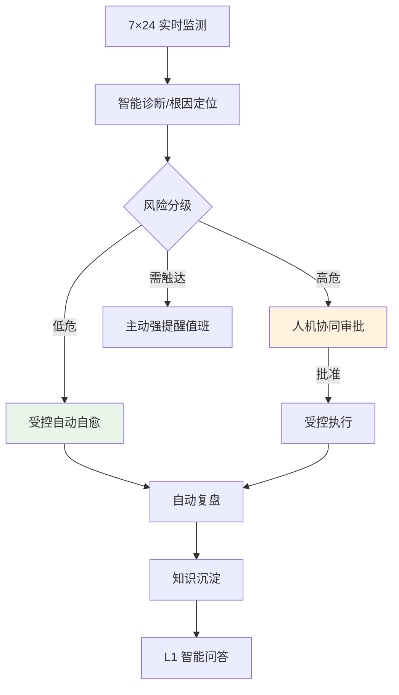
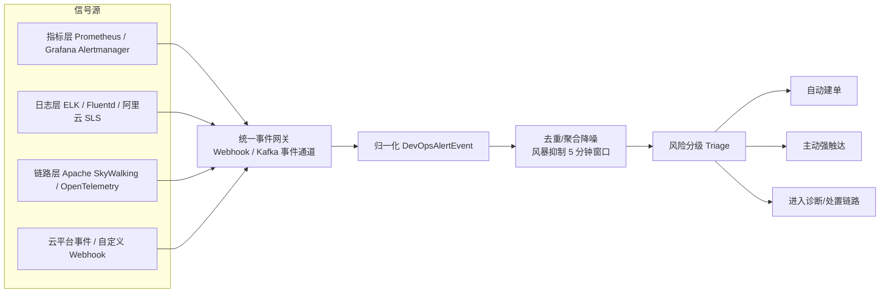
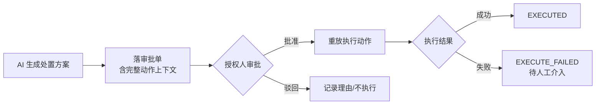

# OpsBrain AI（智维大脑）产品需求文档（PRD）

**文档类型**：最终产品 PRD（目标态愿景 → 完整业务模块 → 商业化路线）
**版本**：v2.3（新增工单双向接入模块）
**日期**：2026-08-26
**状态**：✅ 评审通过（R1-R5 落地 + 新增「外部工单/IM 双向接入」模块；决策门见 §十六）
**文档定位**：从「被动问答/开单助手」演进为「L1–L5 全自动智能自愈运维中枢」的产品蓝图，**以知识资产为支柱、FinOps 为商业化前哨**。

> **版本沿革**：
> - **v2.0**：用户提供蓝本（`prd01.md`），含 7 处 `[待源文件校准]` 标记与 7 项未决问题。
> - **v2.1**：读取蓝图原文校准全部标记 + 代码实测对齐（核查见 `docs/08-benchmark/56`）。
> - **v2.2**：按 58 号评审 R1-R5 修订（商业化收敛 / 知识支柱 / 路线重排 / 指标字典 / 部署合规）。
> - **v2.3（本版）**：按 60 号核查报告新增「AI 运维工单处理智能体」闭环缺口模块——
>   **外部工单系统 / IM 双向接入**（新 §十九 + 附录 E），并对闭环链路逐环节标注状态（§四）。
> - 可行性评估与执行计划见 `docs/08-benchmark/59`；闭环链路核查见 `docs/08-benchmark/60`。

---

## 一、产品概述

### 1.1 产品愿景

让企业运维从「人盯屏、被动救火」进入「**系统自治**」——一个 7×24 小时不休息的 AI 运维大脑：**主动监测、智能诊断、分级处置**。高危交人把关，低危自动自愈，把 SRE 从重复告警中解放出来，专注真正需要人的决策。

### 1.2 产品定位

面向企业的**下一代 AI AIOps 自治运维中枢**：

- 比传统监控告警平台（Prometheus / Zabbix）**多一层大脑**——不只报警，还诊断、决策、处置。
- 比通用 AI 助手**多一层行动力与安全边界**——不只答疑，还能在受控授权下真正执行运维动作。
- **比竞品多一座知识库**——监控巨头不做知识运营，知识资产是差异化护城河（见 §五）。

### 1.3 自治能力分级（产品核心框架 L1–L5）

| 级别 | 名称 | AI 做什么 | 人做什么 | 实现状态（2026-08-26 代码实测） |
| :---: | :--- | :--- | :--- | :--- |
| **L1** | 辅助问答 | 答疑、查知识、开工单 | 全程主导 | ✅ 已完成 |
| **L2** | 主动感知 | 实时监测、自动告警、自动建单、主动触达、降噪 | 处置决策 | ⚠️ 主链路完成；信号源仅 Prometheus 一种 |
| **L3** | 人机协同 | 诊断根因、生成处置方案、等人批准后执行 | 审批把关 | ✅ 闭环完成（治理对象暂限于建单） |
| **L4** | 受控自愈 | 低危场景自动执行处置并回报 | 事后审计 | ❌ 治理骨架全齐，**执行器为零** |
| **L5** | 全自动自治 | 端到端自主监测-诊断-处置-复盘 | 定策略、审边界 | ⏳ 远景，未启动 |

> **产品第一原则**：信任是逐级挣来的。AI 的自主权与它证明的可靠性严格挂钩；每一级都在上一级被充分验证、安全边界清晰后才开放。
> **市场校准（58 号评审）**：Gartner 2025 年将「AIOps Platforms」更名「Event Intelligence Solutions」（全自动修复仍属愿景）；2029 年 70% 企业将部署 agentic AI 参与运维，但 40%+ 项目将在 2027 年前被取消——**治理先行的顺序正确，L4/L5 必须是「信任兑现后的结果」而非「卖点承诺」**。

---

## 二、目标与成功指标

### 2.1 商业目标

- 降低 MTTR，把重复性故障处置自动化。
- 消除告警疲劳，让 SRE 从「告警搬运工」变成「策略制定者」。
- 以运维中枢为底座，**商业化先收敛于 FinOps 一个方向**（§十四），SecOps/混沌/CI-CD 仅作研究备忘，避免主线失焦。

### 2.2 成功指标字典（每个指标 = 目标 + 口径 + 数据源 + 评测集）

> 指标无口径 = 评审会第一质疑点。本表每个指标补齐五要素；「评测集/基线」列为后续建设项（R4）。

| # | 层级 | 指标 | 目标 | 定义与口径 | 数据源 | 评测集/基线 | 现状 |
|:---:|:---:|:---|:---:|:---|:---|:---|:---:|
| 1 | 北极星 | 无需人工介入闭环处置的事件占比 | L4 ≥ 40% | L4 自动闭环事件数 ÷ 事件总数（排除人工处置） | `sys_alert` + 执行记录 | 待 L4 落地后建基线 | ⏳ |
| 2 | 效率 | MTTR 下降幅度 | ≥ 50% | 建单→验证通过时长中位数，环比部署前基线 | `sys_devops_ticket`（`metrics/closure`） | 部署后积累 30 天基线 | ⏳ |
| 3 | 降噪 | 告警到有效工单收敛比（风暴场景） | ≥ 10:1 | 原始告警事件数 ÷ 有效工单数（风暴窗口 30 分钟） | `sys_alert.occurrence_count` + `sys_devops_ticket` | 降噪回放集（真实告警回放） | ⚠️ 去重已实现，统计待做 |
| 4 | 可信 | AI 处置建议采纳率 | ≥ 80% | AI 反馈「有用」÷ 总反馈数 | `ticket_ai_analysis` feedback | 前端反馈入口已实现，聚合看板待做 | ⚠️ |
| 5 | 安全 | 自动处置误操作率 | ≈ 0 | 高危未人审即执行次数（目标恒为 0） | 审批记录 + 审计 | 审批链路测试已覆盖 | ✅ |
| 6 | 触达 | P0/P1 告警到人时延 | ≤ 30s | 告警入库→推送成功时延 P95 | `sys_alert` + 通知记录 | 依赖 P2 可观测性埋点 | ⚠️ |
| 7 | 问答 | 有源答案事实正确率 | ≥ 92% | 评测集内「答案正确且含 citations」占比 | L1 问答评测集 | **评测集待建（R4，2-3 天）** | ⚠️ |
| 8 | 诚实 | 无依据问题正确拒答率 | ≥ 95% | 评测集内无依据问题「正确拒答」占比 | L1 问答评测集 | 同上 | ⚠️ |
| 9 | **知识命中率**（新增） | 问答/分析有源回答占比 | ≥ 70% | 含 citations 的回答 ÷ 总回答 | `complete` 事件 citations | 随评测集 | ⚠️ |
| 10 | **首响 SLA 达成率**（新增） | 首响达标工单占比 | ≥ 95% | 首响时长 ≤ SLA 时限的工单 ÷ 总工单 | `sla/first-response-stats` | 端点已实现 | ✅ |

### 2.3 非目标（明确不做）

开放域闲聊；绕过安全边界的高危自动执行（高危永远走人审）；无真实数据支撑的预测性承诺；替代人对重大变更的最终决策权；
**以及（58 号评审补充）**：智能派单（数据不足）；因果推断 RCA（L3 深水区）；SecOps/混沌工程/CI-CD 卡点的研发投入（仅研究备忘）；SaaS 多租户（近期）；信创适配（近期）；告警预测性能力（诚实原则）。
**以及（60 号核查补充）**：IM 内全双向对话（问答/审批）；钉钉一键授权按钮（单列，不并入工单双向接入模块）；替代外部工单系统本身。

---

## 三、目标用户与场景

| 角色 | 场景 | 核心期待 | 现有功能支撑 |
| :--- | :--- | :--- | :--- |
| 值班 SRE | 半夜告警风暴 | 别刷屏，告诉我「根因是哪个、建议怎么做」 | 告警聚合降噪 + 工单 AI 分析卡片 |
| 运维负责人 | 授权高危操作 | 清楚看到 AI 要做什么，一键批准/驳回 | 审批中心（放行/驳回/重放/留痕） |
| 一线运维 | 日常查规范、开单 | 自然语言问答 + 自动建单 | L1 问答 + 建单工具 |
| 平台管理员 | 定自治策略 | 控制 AI 在哪些场景能自动、自动到什么程度 | 自动化策略页 / 动作白名单页 / 风险分级页 |
| 技术管理者 | 看运维健康度 | 趋势、成本、风险一屏掌握 | Dashboard + 多维趋势 |
| **业务方/报障人**（新增） | 一键报障、跟踪进度 | 报障不依赖运维经验，进度可视 | ⚠️ 手动建单已支持；报障自助门户待做 |
| **合规审计员**（新增） | 追溯 AI 决策与动作 | 留痕可导出、可问责 | ✅ 审计页 + 操作留痕 |

**关键用户故事**
- 作为**值班 SRE**，节点宕机引发几十条告警时，我只想收到「一个故障源 + 建议处置」。（✅ 已支持）
- 作为**运维负责人**，AI 要重启生产服务时，我想在钉钉一键看到方案并决定批不批。（✅ 钉钉通知 + 审批中心；⏳ 钉钉内一键授权按钮待做）
- 作为**平台管理员**，我想设定「磁盘清理可自动，重启/扩容必须人审」。（✅ 治理骨架已支持；⏳ 自动执行待 L4 执行器）

---

## 四、产品功能总览（附实现状态）

| 模块 | 能力 | 对应级别 | 优先级 | 实现状态（代码证据见附录 A） |
| :--- | :--- | :---: | :---: | :--- |
| 智能问答 | 知识问答 + 自动开单 + 来源回链 | L1 | P0 | ✅ 已完成 |
| **知识资产运营**（新增支柱） | 知识获取管道 + 质量治理 + 度量 | L1/L3 | P0 | ⚠️ 治理能力已实现，运营看板待做（§五） |
| 实时监测 | 事件驱动监控 + 自动告警 + 自动建单 | L2 | P0 | ⚠️ 主链路完成；仅 Prometheus 一种信号源 |
| 主动触达 | 高危告警多渠道强提醒 | L2 | P0 | ⚠️ 钉钉 + WebSocket + 通知中心已实现 |
| 告警降噪 | 跨源聚合 + 风暴抑制 | L2 | P0 | ✅ 同键去重 + 跨键风暴抑制已实现 |
| 智能诊断 | 根因定位 + 处置方案生成 | L3 | P0 | ⚠️ 结构化分析/RCA 闭环已实现；因果推断缺失 |
| 人机协同 | AI 提议 → 人审 → 重放执行 | L3 | P0 | ✅ 审批闭环已实现 |
| 受控自愈 | 低危自动闭环 + 回报 | L4 | P1 | ❌ 后端零实现（治理骨架已备好） |
| 安全边界 | 分级授权 + 工具白名单 + 审计 | L2–L5 | P0 | ✅ 五项机制全部已实现（§十一） |
| 运维看板 | 健康度/趋势/成本/风险/知识运营 | 全级 | P1 | ⚠️ 健康度/趋势已实现；知识运营看板待做 |
| 部署与合规 | 私有化单租户 + 凭据隔离 | 全级 | P0 | ✅ 已具备（§十三） |
| **工单双向接入**（新增） | 外部工单系统 / IM 入向建单 + 处置结果回写 | L2/L3 | P1 | ❌ 未实现（§十九，待立项） |
| 商业化拓展 | FinOps 先行（侦察兵） | L4+ | P2 | 📄 蓝图 + 收敛方向（§十四） |

> **「AI 运维工单处理智能体」闭环链路逐环节状态**（60 号核查）：
> 监控告警建单 ✅ / 外部工单系统接入 ❌（§十九）/ IM 入向建单 ❌（§十九）/ 站内建单 ✅ /
> AI 理解工单 ✅（分析卡片，自动触发 ⏳ V2.0）/ 检索知识库 ✅ / 检索历史工单 ✅ / 检索日志 ❌（V2.0 SLS）/
> 推荐处置方案 ✅ / 人工审批 ✅ / 真实执行修复 ❌（V1.2 执行器）/ 验证 ✅（人工；自动校验 ⏳ V1.3）/
> 沉淀经验 ✅（复盘→知识库）/ 站内闭环 ✅ / 回写外部系统 ❌（§十九）。

---

## 五、知识资产运营（产品支柱，R2 新增）

> **为什么是支柱**：Gartner 指出 AIOps 平台表现不佳的主因是**依赖/配置数据质量差**；而 BigPanda / Datadog 等竞品均不提供知识库运营。**「知识资产的准」比「模型的强」更决定成败——这是 OpsBrain AI 的护城河。**
> 本支柱把分散在 L1/复盘/告警链路中的知识能力统一定义为一条「管道」。

### 5.1 知识获取管道（三入口）

| 入口 | 场景 | 实现状态 |
|------|------|:---:|
| 手册导入 | 运维手册/规范批量切片入库 | ✅ 文档 CRUD + 父-子切片 + 向量化 |
| 复盘沉淀 | 故障复盘一键转知识库（含来源回链） | ✅ `KnowledgeSinkDrawer` |
| 告警经验 | 告警处置结论沉淀为「案例知识」 | ⚠️ 复盘链路可覆盖；告警直达案例模板待做 |

### 5.2 质量治理门（已有能力，统一定义）

| 治理项 | 机制 | 实现状态 |
|--------|------|:---:|
| 清洗去重 | 知识清洗（R3）+ 分类/标签规范 | ✅ |
| 保留期 | 过期文档自动归档 | ✅ `KnowledgeRetentionScheduler` |
| 冷记忆归档 | 低频知识转 MinIO 冷存 | ✅ `ColdMemoryArchiveScheduler` |
| 孤儿清理 | 无主切片回收 | ✅ `OrphanChunkCleanupScheduler` |
| 可见性 | 文档可见性控制 | ✅ migration_v24 |

### 5.3 知识度量（对应 §2.2 #7/8/9）

| 指标 | 口径 | 现状 |
|------|------|:---:|
| 知识命中率 | 含 citations 的回答 ÷ 总回答 | ⚠️ 数据已有（complete 事件），聚合待做 |
| 拒答率 | 无依据正确拒答 ÷ 无依据问题 | ⚠️ 评测集待建 |
| 盲区闭环率 | 高频问低命中的主题 → 已补文档的占比 | ⚠️ `hotQueryCount` 已埋，流程与看板待做 |
| 知识新鲜度 | 活跃文档 ÷ 文档总数 | ⚠️ 治理调度数据可聚合 |

### 5.4 消费端

L1 问答（§六）、AI 分析卡片（§八）、诊断引用（citations）、复盘回写（§四 闭环）。**同一份知识资产，四个消费端**。

### 5.5 差距清单（P1-P2 排期）

1. 知识运营看板前端（`hotQueryCount` 后端已有，展示待做）——1-2 天；
2. 知识盲区闭环流程（盲区列表 → 指派补文档 → 复核命中率）——2-3 天；
3. 告警案例直达知识模板——1 天。

---

## 六、L1 智能问答与辅助（✅ 已完成）

### 6.1 能力

自然语言问答企业运维知识，自动开工单，答案带来源回链，不编造。这是用户对产品建立信任的第一步，**也是知识资产支柱的核心消费端**。

### 6.2 核心契约（四层幻觉防护）—— 实现状态对照

| 层 | 机制 | 作用 | 实现状态与代码位置 |
| :---: | :--- | :--- | :--- |
| L1 检索门槛 | 相关度低于阈值直接拒答 | 无依据不进生成 | ✅ `HybridRetrieverService`，`min-similarity-score:0.73` 熔断 |
| L2 Prompt 约束 | 强制「仅依据给定片段，无依据则说不知道」 | 抑制自由发挥 | ✅ `@SystemMessage` 强约束 |
| L3 来源校验 | 校验答案主张是否有片段支撑 | 无支撑不呈现 | ✅ `citations[]` 从检索片段提取随 `complete` 事件下发 |
| L4 UI 呈现 | 标注来源与置信度，低置信显著提示 | 不确定交给用户 | ✅ AI 分析卡片：置信度三档配色 + 引用文档链接 |

- **无有效来源不呈现**：宁可拒答，不可编造。（✅ 低于 0.73 直接返回「知识库无相关文档」）
- **工具白名单**：问答链路可调用工具严格受限（仅知识检索 / 建单两类）。（✅ `DevOpsTools` 仅 2 个 `@Tool`）

### 6.3 验收（附当前达标情况）

| 验收项 | 状态 | 说明 |
|--------|:---:|------|
| 问库内已知问题 → 答案正确附可点击来源 | ✅ | 答案含 citations，前端渲染来源链接 |
| 库外/敏感问题 → 诚实拒答不编造 | ✅ | 0.73 门槛 + Prompt 约束 + 输入门卫 |
| 开单 → 真正落库，不谎称已创建 | ✅ | 建单落库 + 工单页可见；审批场景文案「待审批」 |

---

## 七、L2 全天候实时监测与第三方接入（⚠️ 主链路完成）

### 7.1 从「被动响应」到「事件驱动」（✅ 已达成）

| 维度 | 被动助手 | OpsBrain L2 | 现状 |
| :--- | :--- | :--- | :--- |
| 触发 | 用户提问 | 外部事件/指标异常自动触发 | ✅ Webhook 自动触发 |
| 在场 | 需人打字 | 7×24 无人值守 | ✅ 后端常驻 + 定时扫描 |
| 时效 | 取决于人何时问 | 秒级自动感知 | ✅ 事件驱动 |
| 覆盖 | 问到才知道 | 全量持续监测 | ⚠️ 取决于信号源接入数 |

### 7.2 接入架构分层（蓝图 §一校准）

> **蓝图明确的反模式**：禁止用 `@Scheduled` 高频轮询第三方——一律走 **Webhook / Kafka 事件通道**（蓝图 §一.1）。

### 7.3 接入信号源清单（蓝图校准完成版）

| 信号源 | 接入方式（蓝图契约） | 用途 | 优先级 | 实现状态 |
| :--- | :--- | :--- | :---: | :--- |
| 指标层：Prometheus / Grafana Alertmanager | Webhook `POST /api/v1/webhook/prometheus` | 阈值告警（如 K8s 内存 > 90%） | P0 | ✅ `AlertWebhookController` |
| 日志层：ELK / Fluentd / 阿里云 SLS | Webhook `POST /api/v1/webhook/aliyun-sls` | 异常模式识别、日志聚合分析 | P0 | ❌ 端点未建（契约已定，落地即接线） |
| 链路层：SkyWalking / OpenTelemetry | 集成/订阅 | 慢调用、错误率、链路归因 | P1 | ❌ 未接 |
| 云平台事件 | 云 API 事件流 | 资源/成本/安全事件 | P1 | ❌ 未接（FinOps 依赖） |
| 自定义 Webhook | 开放接口 | 第三方系统接入 | P0 | ✅ 端点开放；来源注册与鉴权待完善 |
| Kafka 高吞吐事件通道 | Kafka 订阅 | 高吞吐告警流不丢不堵 | P1 | ❌ 未接（当前直连 Webhook） |

### 7.4 事件处理三层去重语义（降噪核心）—— 蓝图参数校准

| 层 | 处理 | 用户可见效果 | 实现状态 |
| :---: | :--- | :--- | :--- |
| **L1 同键去重** | 完全相同告警只计次，不重复建单 | 不重复 | ✅ `computeDedupKey`（alertName\|service\|labels → SHA-256）+ `occurrenceCount` |
| **L2 跨键同源聚合** | 同故障源不同告警，窗口内归并到一张工单 | 不刷屏 | ✅ 跨键风暴抑制 |
| **L3 跨源独立** | 不同故障源各自建单 | 不误并 | ✅ dedupKey 不同 → 各自建单 |

**蓝图聚合参数校准**（蓝图 §一.2「5 分钟内相同 Pod/IP 的 1000 条报错压缩为 1 个总事件」）：

| 参数 | 蓝图规格 | 代码实测 | 结论 |
|------|---------|---------|:---:|
| 聚合时间窗口 | **5 分钟** | `devops.alert.aggregate-window-minutes:5`（可配置） | ✅ 一致 |
| 聚合维度 | **相同 Pod/IP**（实例级） | dedupKey = alertName + service + labels（含 instance/pod） | ✅ 一致 |
| 收敛目标 | 1000 条报错 → **1 个总事件** | 同 dedupKey 命中活跃告警 → 递增 occurrenceCount | ✅ 一致 |

**契约**
- **降噪不丢可见性**：被抑制告警仍入库、可查、留痕，只抑制「重复建单」与「重复骚扰」。（✅ 全量落库 `sys_alert`）
- **聚合以故障源为界**：同源聚合，跨源不误并，无法判定归属时宁可独立建单。（✅ dedupKey 语义一致）

### 7.5 主动触达（蓝图渠道矩阵校准）

| 渠道 | 蓝图规格 | 优先级 | 实现状态 |
| :--- | :--- | :---: | :--- |
| 钉钉 | 一键弹窗强提醒 + `[一键授权 AI 执行修复]` 按钮 | P0 | ⚠️ 通知已实现（markdown + 加签）；**一键授权按钮待做** |
| 飞书 | 一键弹窗强提醒 | P1 | ❌ 未接 |
| PagerDuty | 一键弹窗强提醒 | P1 | ❌ 未接 |
| WebSocket 实时流 | 站内实时告警流 | P0 | ✅ `AlertWebSocketHandler` |
| 通知中心 | 低级别告警持久化、可查 | P0 | ✅ 前端 store + 后端拉取 |

- **分级触达**：P0/P1 走强提醒，低级别进通知中心。（✅）
- **可靠性**：通知失败旁路兜底，不阻塞主监测流程，失败留痕待补发。（✅ 通知异常只 WARN 不外抛）
- **时效**：高危到人 ≤ 30s。（⚠️ NFR 目标，未做端到端 SLA 断言）

---

## 八、L3 智能诊断与人机协同（✅ 闭环完成）

### 8.1 智能诊断

AI 定位根因、生成分级处置方案。方案含：疑似根因、建议动作、风险等级、影响面、回滚预案。

| 方案要素 | 蓝图规格（§二 P0/P1 路径） | 实现状态 |
|---------|--------------------------|:---:|
| 疑似根因（有序列表） | 秒级跨链路日志聚合分析定位 RCA | ✅ AI 分析卡片（结构化渲染） |
| 建议动作 | 生成处置方案 | ✅ 处置阶段动作列表 + 建议卡片 |
| 风险等级 | 故障分级 P0-P4 → 自治等级映射 | ✅ `@ToolMeta(riskLevel)` + `RiskPolicy` |
| 影响面 | — | ⚠️ 策略层 `maxBlastRadiusCount` 有配置，无真实影响面计算 |
| 回滚预案 | 完整回滚命令/扩容配置脚本 | ⚠️ Saga 补偿动作已建模，前端占位 |
| 诊断报告 | 深度诊断报告（含回滚/扩容脚本） | ⚠️ 结构化分析卡片已实现；完整脚本级报告待深化 |

### 8.2 人机协同审批闭环（信任枢纽）—— 实现对照

| 节点 | 实现状态 | 代码位置 |
|------|:---:|---------|
| 落审批单含完整动作上下文 | ✅ | `sys_approval_request.payload`（可重放 JSON 原文） |
| 授权人审批（批准/驳回） | ✅ | `ApprovalController`：approve / reject（驳回必填理由） |
| 重放执行动作 | ✅ | `ApprovalOrchestrator`：APPROVED 与 EXECUTED 分离 |
| 执行结果回写 EXECUTED / EXECUTE_FAILED | ✅ | 同上（失败可人工重试，不撤销批准） |
| 超时未审批 EXPIRED | ✅ | `ApprovalStatus.EXPIRED`（定时任务标记） |
| 待人工介入队列 | ✅ 后端 / ❌ 前端 | `/saga/attention` 就绪，前端占位（P1） |

**核心契约**
- **高危绝不自动执行**：一律走「AI 提议 → 人审 → 批准后重放执行」。（✅ `requiresApproval=true` 运行时校验）
- **批准后执行失败不回退批准**：人的决策是既成事实，失败标记待人工介入，不撤销批准。（✅ `ApprovalOrchestrator` 明示）
- **审批限授权角色**：角色实时校验，改权限立即生效；全程留痕。（✅ `@SaCheckRole("ADMIN")` + 审计）
- **模型不得谎称已执行**：落审批单后返回文案明确「待审批」。（✅）

### 8.3 验收（附当前达标情况）

| 验收项 | 状态 |
|--------|:---:|
| AI 提议高危处置 → 人审批准后才执行、驳回则不执行 | ✅（含 5 例写端点集成测试） |
| 非授权角色审批 → 拒绝 | ✅ 角色边界测试覆盖 |
| 全程可追溯 | ✅ 审批单 + 操作审计 + Agent 轨迹 |
| ⏳ 钉钉一键授权执行（蓝图 P0/P1 路径第 4 步） | ❌ 待做（P1） |

---

## 九、L4 受控自愈（❌ 执行器为零，治理骨架已备好）

### 9.1 能力边界

在**被充分验证、边界清晰的低危场景**，AI 自动执行处置并回报。**自主权限于低危，高危永远回到 L3 人审。**

### 9.2 低危场景白名单（蓝图校准完成版）

| 故障档位 | 典型场景（蓝图原文） | 建议动作 | 风险 | 兜底 | 实现状态 |
| :---: | :--- | :--- | :---: | :--- | :--- |
| **P2/P3 中低危**（半自动自愈+观察） | 微服务 OOM、SSL 证书 7 天到期、MQ 轻度积压、Pod CrashLoop | 自动建单 → 非破坏性自愈（`kubectl rollout restart` 优雅重启单节点）→ **5 分钟健康心跳** → 正常结单，异常升级 P1 | 低-中 | 失败标记待人工 + 升级 P1 | ⏳ 治理链路已备，执行器待开发 |
| **P4 常规琐碎**（全自治） | `/var/log` 磁盘 > 85%、Docker 孤儿镜像、夜间空闲进程 | `logrotate -f`、`docker system prune -a --force`、空闲回收；完成后群内推送摘要 | 低 | 保留清理清单可追溯 | ⏳ 同上 |
| **P0/P1 高危**（永不自愈） | MySQL 主库死锁、核心网关 502、业务表误删、网络分区 | **回到 §八 L3 人机协同**：秒级 RCA + 完整回滚/扩容脚本 + 强提醒 + 一键授权 | 高 | 人审 + 审批留痕 | ✅ 人审机制已实现；一键授权待做 |

### 9.3 安全沙盒契约（蓝图 §三校准）

| 契约 | 蓝图规格 | 实现状态 |
| :--- | :--- | :--- |
| **原子操作白名单枚举** | `ActionPermissionLevel`：`READ_ONLY_DIAGNOSTIC`（默认全开放）/ `SAFE_AUTO_HEALING`（P3/P4 全自动允许）/ `DESTRUCTIVE_HIGH_RISK`（必须人工签发 Token） | ⚠️ 治理骨架已支持；**三枚举与执行器落地待 P4** |
| **爆炸半径控制（金丝雀自愈）** | 20 实例集群只先重启 **1 个 Pod（1/20 = 5%）**；60 秒后校验 HTTP 200 成功率恢复到 **99.9%** 才继续 | ❌ `maxBlastRadiusCount` 仅配置数字，无代码按它拦截过真实操作 |
| **自愈回滚触发器** | 执行前 Redis 记录 `Snapshot_Before_Healing`；修复后 3 分钟内错误率飙升 → 自动 `kubectl rollout undo` | ❌ 未实现（依赖 P4 执行器 + 监控联动） |
| **只做白名单内动作** | 不在白名单内一律回落人审 | ⚠️ 骨架就绪，待执行器 |
| **执行失败不掩盖** | 标记 EXECUTE_FAILED，回报并转人工 | ✅ 状态机已实现 |
| **每次自愈可审计** | 谁授权（策略）、做了什么、结果如何全程留痕 | ✅ 审计 + 工具执行记录 |

---

## 十、L5 全自动自治（远景）

端到端自主完成「监测-诊断-处置-复盘-知识沉淀」闭环，人退到「定策略、审边界」。这是产品北极星，非首发承诺。
**可靠性证据门（58 号评审补充）**：连续 N 次低危自愈零误操作 + 审计完整 + 可观测性达标（P2），才开放下一个场景。L5 不是里程碑，是长期验证的结果。

---

## 十一、安全边界（贯穿全级，不可妥协）—— 五项全部已实现

| 机制 | 说明 | 实现状态与代码位置 |
| :--- | :--- | :--- |
| **工具白名单** | AI 可调用动作严格受限，白名单外无法执行 | ✅ `DevOpsTools` 仅 2 个 `@Tool`，物理隔离 Shell/文件系统 |
| **分级授权** | 自主权与风险分级严格挂钩，高危强制人审 | ✅ `@ToolMeta(requiresApproval / riskLevel)` + 运行时校验 |
| **RBAC** | 不可逆/高危操作限管理员；常规操作登录即可 | ✅ Sa-Token + `@SaCheckRole("ADMIN")` + 角色导航 |
| **全程审计** | 每个 AI 决策与动作可追溯、可回放、可问责 | ✅ `sys_operation_audit` + `sys_agent_tool_execution` + Agent 轨迹 |
| **凭据隔离** | 密钥仅环境变量，不落代码 | ✅ `.env.example` + gitignore；API Key 不入库 |

> **蓝图补充项（L4 安全前提）**：`ActionPermissionLevel` 三枚举、爆炸半径真实计算、Redis 快照 + 自动回滚——见 §9.3。

---

## 十二、运维看板与数据分析（⚠️ 部分实现）

| 需求 | 实现状态 |
|------|:---:|
| **健康驾驶舱**：系统健康、活跃事件、待审批动作 | ✅ Dashboard 总览 + 待审批计数 |
| **多维趋势**：工单量、告警量、MTTR、满意度趋势 | ✅ ECharts 三处接入，按天/服务/优先级下钻 |
| **成本视图**（FinOps 前哨）：LLM 成本 + 云资源成本 | ⚠️ LLM 成本已埋（`CostQuotaManager` + costRmb）；**云资源成本未接**（依赖云平台事件源，FinOps 板块） |
| **知识盲区**：高频问低命中的主题 | ⚠️ `hotQueryCount` 已埋点；前端展示与闭环流程待做（§5.5） |
| **告警收敛比 / 采纳率 / 拒答率**（§2.2 #3/4/8） | ⚠️ 数据链路已通，聚合展示待做（随评测集 R4） |

> 数据看板只做**历史统计可视化**，不暗示预测能力（诚实占位原则）。

---

## 十三、部署模型与合规边界（R5 新增）

| 项 | 声明 | 现状 |
|----|------|:---:|
| **部署形态** | **私有化单租户**（当前唯一形态）：Docker Compose 一键部署 + Dockerfile + CI 验证 | ✅ `docker-compose.yml` / `docker-compose.dev.yml` / `Dockerfile` 齐全 |
| **SaaS 多租户** | **明确不做**（近期范围外）；架构预留租户隔离扩展点 | ⚠️ 远期 |
| **信创适配** | 市场进入选项（P2+）：麒麟/欧拉 + 国产中间件 + 国产向量库 | ⚠️ 未投入，作为评估项 |
| **等保合规** | 等保 2.0 三级为远期目标；当前做到：凭据隔离 + 审计留痕 + RBAC | ✅ 基础已具备 |
| **数据边界** | 知识库与告警数据默认本地化存储（pgvector/Redis/MinIO 自托管） | ✅ |
| **模型接入** | DeepSeek/百炼等 API 可配置，密钥仅环境变量 | ✅ |

---

## 十四、商业化拓展远景（R1 收敛：FinOps 先行）

> **58 号评审修正**：原四板块并列（FinOps/SecOps/混沌/CI-CD）改为**单点突破**——
> SecOps 已被云厂商安全中心/WAF 内置、混沌工程是 niche 市场、CI/CD 卡点被 GitLab/GitHub 覆盖；
> **FinOps 是唯一「底座复用最顺 + 市场增量明确」的方向**。原则：**用一个方向的真实数据证明复用底座，而不是四个方向的 PPT。**

| 方向 | 复用底座 | 新增价值 | 状态 |
| :--- | :--- | :--- | :--- |
| **FinOps（先行·侦察兵）** | LLM 成本底座（`CostQuotaManager` + costRmb）+ 监测/分析引擎 | ① 云资源闲置巡检（如 16C32G ECS 周均 CPU 3% → 降配建议）；② 夜间 22:00 关 / 08:30 开 + 健康校验（立省 40-60% 云成本）；③ 成本异常告警 | 📄 蓝图 + LLM 成本已具备；云资源成本数据源待接 |
| SecOps | 事件驱动 + 处置闭环 | 安全事件自动响应 | 📄 仅研究备忘，不投入研发 |
| 混沌工程 | 自愈验证能力 | 韧性评分 | 📄 仅研究备忘 |
| CI/CD 卡点 | 事件驱动 + 代码理解 | 自动修复 PR | 📄 仅研究备忘 |

**FinOps 落地的三步走**：① 先做「LLM 成本看板」（零成本，复用现有 costRmb）→ ② 接云平台账单/事件源 → ③ 夜间开关机自动化（L4 执行器成熟后）。

---

## 十五、非功能需求（附实现现状）

| 类别 | 要求 | 实现现状 |
| :--- | :--- | :--- |
| 实时性 | 事件感知到告警秒级；高危触达 ≤ 30s | ✅ 事件驱动秒级；触达 30s 为目标未断言 |
| 性能 | 问答首字 P95 ≤ 2.5s；检索 P95 ≤ 500ms | ✅ 语义缓存命中 0 花费；检索含阈值熔断；压测基准待补 |
| 规模 | 百万级知识片段；500+ 并发；高吞吐事件流 | ⚠️ pgvector 支撑；未压测；高吞吐依赖 Kafka（P1） |
| 可用性 | 核心链路 SLA ≥ 99.5%；通知失败旁路不阻塞主流程 | ✅ 通知旁路已实现；**自身可观测性缺失（无 actuator，P2）** |
| 安全 | 凭据不落代码；分级授权；工具白名单；全量审计 | ✅ 全部已实现（§十一） |
| 可扩展 | 通知/诊断/处置渠道可插拔 | ⚠️ 通知已抽象；信号源/执行器待适配器化 |
| 可观测 | 全链路 traceId，支撑复盘与问责 | ✅ traceId 唯一来源 + MDC 全链路 |
| **评测集**（R4 新增） | 指标可对口径、可重复验证 | ⚠️ 待建：L1 问答评测集 + 降噪回放集 |

---

## 十六、发布路线（R3 重排：价值轨 / 卫生轨 + 演示剧本验收）

> **58 号评审修正**：原 P1-P4 按「工程债」排序，改为**按「市场价值 × 可演示性」排序**——
> 每个里程碑以**演示剧本**为验收（对采购方/面试官，「能演示的闭环」>「内部卫生」）。

### 16.1 价值轨（主线）

| 里程碑 | 内容 | 预估 | Exit Criteria（含演示剧本） |
|:---:|------|:---:|---------------------------|
| **V1.1 闭环可见性** | P1 Saga 补偿中心 + 人工介入队列前端（2-3 天）；P2 自身可观测性 actuator/micrometer（3-5 天，注意 `/actuator/**` 必须加鉴权） | 2-4 周 | 演示剧本 v1：5 分钟讲完「告警→建单→诊断→审批→补偿→审计」全链路；`/actuator/health` 含模型/向量库可达性 |
| **V1.2 第一个真实执行器** | P4 只读执行器（推荐 K8s fabric8 + 本地 kind；CI 用 mock 契约测试，见 59 号报告 D1） | 4-8 周 | 演示剧本 v2：真实告警 → AI 诊断 → 白名单只读查询 → 审计留痕；治理链路被第二个场景验证 |
| **V1.3 低危写操作最小实现** | 非生产命名空间单实例重启 + 5 分钟心跳验证；金丝雀 5% + Redis 快照回滚最小实现（蓝图 §三） | 8-12 周 | 演示剧本 v3：低危自愈沙盒完整跑通 + 失败兜底演示；金丝雀拦截真实生效 |
| **V2.0 知识与指标深化** | 日志源接入（阿里云 SLS，契约已定）；L1 问答评测集 + 降噪回放集；知识运营看板 + 盲区闭环流程（§5.5） | 12 周+ | 演示剧本 v4：指标看板对口径演示（命中率/拒答率/收敛比）；知识盲区从发现到补齐的闭环 |

### 16.2 卫生轨（随时并行，不阻塞价值轨）

| 项 | 内容 | 预估 |
|----|------|:---:|
| P3 Flyway 接管迁移 | 19 个手工 SQL → 版本化（`baselineOnMigrate=true`，prod `cleanDisabled=true`） | 2-3 天 |
| 前端占位路由治理 | 5 个自愈占位路由实现前从导航摘除（防「空壳」观感） | 0.5 天 |

### 16.3 决策门（进入对应里程碑前拍板）

| 决策门 | 选项 | 影响 | 时限 |
|--------|------|------|------|
| **D1 执行器目标系统** | K8s（fabric8，推荐）/ 云 API / 内部脚本平台 / 纯 Mock | 决定 V1.2 执行器抽象与凭证层 | 本周 |
| D2 是否本机搭建 kind 演示环境 | 是（推荐，免费）/ 否（纯 mock） | V1.2 演示真实性 | 随 D1 |
| D3 日志源 SLS 是否立接 | 接（纯适配）/ 缓 | V2.0 范围 | V2.0 前 |
| D4 钉钉一键授权按钮 | 排期 P1 / 缓 | L3 触达闭环最后一公里 | V1.1 后 |
| D5 商业化收敛 FinOps | 收敛（本版已按此执行）/ 维持四板块 | §十四 | 已默认收敛，可复议 |

---

## 十七、验收标准（用户视角汇总，附当前达标情况）

| # | 验收标准 | 当前状态 |
|:---:|---------|:---:|
| 1 | 库内问题→答案正确附出处；库外→诚实拒答不编造 | ✅ |
| 2 | 外部监控推送异常→秒级自动感知并建单，无需人工提问 | ✅（Prometheus 源） |
| 3 | 同源告警风暴→收敛为一个故障视图 + 一张工单；被抑制告警仍可查 | ✅（5 分钟窗口） |
| 4 | 完全重复告警→只递增计次不新建单；不同故障源→各自独立建单 | ✅ |
| 5 | P0 告警→值班 30s 内收到强提醒；通知故障时有兜底留痕 | ⚠️ 通道✅、30s 未断言 |
| 6 | AI 提议高危处置→人审批准后才执行、驳回不执行、全程留痕 | ✅ |
| 7 | 低危场景（L4）→AI 自动处置并回报，失败标记待人工 | ❌ 待 L4 执行器 |
| 8 | 任一 AI 动作→可追溯到「谁授权、做了什么、结果如何」 | ✅ |
| 9 | （新增）每个里程碑有可演示的闭环剧本（§16.1） | ⏳ V1.1 起 |
| 10 | （新增）指标可对口径：评测集可重复运行 | ⏳ V2.0 |

---

## 十八、风险与未决问题

### 18.1 风险与应对

| 风险 | 影响 | 应对 |
| :--- | :--- | :--- |
| 自动处置误操作 | 生产事故 | 高危强制人审 + 白名单 + 分级授权 + 金丝雀 5% + 自动回滚（部分就绪，金丝雀/回滚待 V1.3） |
| 用户不信任 AI 自主权 | 采纳率低 | L1→L5 渐进放权，信任逐级挣得 |
| 告警质量差致误诊 | 处置错误 | 降噪 + 根因定位 + 人审兜底 |
| 横向扩张摊薄核心 | 主线失焦 | **已收敛：FinOps 单点先行**（§十四） |
| 指标无评测集支撑 | 评审/采购质疑 | R4 评测集建设排入 V2.0 |
| 执行器选型错误 | 返工 | D1 决策门 + 双轨验证（mock 契约 + 真实演示） |

### 18.2 未决问题（待拍板，详见 §16.3）

D1 执行器目标系统选型（本周）；D2 本机 kind 演示环境；D3 SLS 接入；D4 钉钉一键授权；D5 商业化收敛复议。
其余 v2.0/v2.1 未决问题已全部校准答复（见 56 号报告 §三）。

---

## 十九、工单双向接入（外部工单系统 / IM）—— 新增模块（60 号核查缺口 A/D）

> **背景**：「AI 运维工单处理智能体」闭环（§四）的入向（外部工单/IM）与出向（回写）缺口。
> 目标：让 OpsBrain 接入**企业已有的工单系统与 IM**，处置全程可回写源系统，形成「外部世界」闭环。
> **不做**：IM 内全双向对话（问答/审批）、钉钉一键授权按钮（单列）、替代外部工单系统。

### 19.1 入向接入（工单来源适配器）

| 来源 | 接入方式 | 契约（对齐现有 `AlertmanagerWebhook` DTO 风格） | 优先级 |
|------|---------|---------------------------------------------|:---:|
| 外部工单系统（Jira/ServiceNow/自研） | 通用 Webhook `POST /api/v1/webhook/external-ticket` | `ExternalTicketEvent`：title / description / priority / module / source / externalId / callbackUrl | P1 |
| IM（钉钉/企微机器人） | IM 回调 Webhook `POST /api/v1/webhook/im` | 消息文本 → 解析建单；`source=IM` 留痕 | P1 |
| 监控告警（已有） | 现有 `AlertWebhookController` | 保持不动 | ✅ |

**统一入口**：全部走 `TicketService.createTicket(title, priority, module, description, assignee, category, sla, creator, tags)`（已确认签名），来源经 `TicketSource` 枚举（INTERNAL / ALERT / EXTERNAL / IM）留痕。

**幂等**：`externalId` 唯一索引，防重复建单（对齐告警 dedupKey 思路）。

**映射**：外部系统优先级 → 站内四档（P0-P3）+ SLA 时限表映射。

### 19.2 出向回写（处置结果回写源系统）

| 触发点 | 回写内容 | 方式 |
|--------|---------|------|
| 工单状态变更（处理中/已解决/已关闭/作废） | 状态 + 处理摘要 + 根因 + 验证结果 + 知识库链接 | 出向 Webhook POST 到 `callbackUrl`（入向事件携带） |
| 审批结果（高危动作） | 审批人/时间/动作/结果 | 同上 |
| 验证通过/跳过 | 验证结论 | 同上 |

- **契约**：`TicketStatusCallback` JSON；失败重试 3 次 + 留痕待补发（对齐通知旁路契约）。
- **范围**：仅回写「来源为外部系统/IM」的工单，站内工单不回写。

### 19.3 验收标准

| # | 验收项 |
|:---:|--------|
| 1 | 外部工单系统 Webhook 推送 → 站内自动建单，`source=EXTERNAL`，重复推送不重复建单（externalId 幂等） |
| 2 | IM 消息 → 解析建单（含关键词/格式失败时返回可理解的提示并留痕） |
| 3 | 站内工单状态变更 → 自动回写源系统 `callbackUrl`，失败重试 + 留痕可查 |
| 4 | 外部来源工单在前端展示来源标识与外部链接 |
| 5 | 优先级/SLA 映射正确（外部 P1 → 站内 P0 等，按映射表） |

### 19.4 排期与前置

- **前置**：V1.1（Saga 前端 + 可观测性）→ V1.2（执行器）——本模块建议排在 V2.0 与执行器之间（约 1-2 周）；
- **依赖**：入向复用 `TicketService.createTicket`；出向复用通知旁路契约（重试 + 留痕）。

---

## 附录 A：模块 → 实现状态 → 代码位置 速查表

| 模块/能力 | 状态 | 关键代码位置 |
|----------|:---:|-------------|
| SSE 流式四事件契约 | ✅ | `DevOpsChatController` |
| 意图路由（大小模型） | ✅ | `DevOpsIntentRouter` |
| 语义缓存 | ✅ | `SemanticCacheService`（0.95 相似复用） |
| 混合检索 + 0.73 熔断 | ✅ | `HybridRetrieverService` |
| 幻觉防护（四层） | ✅ | 检索门槛 + `@SystemMessage` + citations + 前端置信度 |
| 知识库 CRUD/版本/分类/标签 | ✅ | Knowledge 4 控制器（38 端点） |
| 知识治理（保留期/冷归档/孤儿/清洗） | ✅ | 3 个治理 Scheduler + R3 清洗 |
| 知识运营看板/盲区闭环 | ⚠️ | `hotQueryCount` 已埋，前端待做 |
| 工具白名单（2 个 @Tool） | ✅ | `DevOpsTools` + `ToolRuntimeManager` |
| 工单业务闭环（B0-B5） | ✅ | `TicketController`（35+ 端点）+ `TicketEnums` |
| 告警接入/去重/聚合/风暴抑制 | ✅ | `AlertWebhookController` / `AlertService`（dedupKey，5min 窗口） |
| 主动触达 | ⚠️ 部分 | `DingTalkNotifier` + `AlertWebSocketHandler` + 通知中心 |
| 人机协同审批 | ✅ | `ApprovalController` + `ApprovalOrchestrator` |
| Saga 补偿 | ✅ 后端 / ❌ 前端 | `SagaController` + `SagaCompensationManager`；前端占位（P1） |
| 自动化治理配置页 | ✅ | `AutomationPolicies.vue` / `ActionAllowlist.vue` / `RiskLevels.vue` |
| 鉴权 RBAC + 审计 | ✅ | Sa-Token + `AuditLogController` + `sys_operation_audit` |
| AI 分析卡片/Insights/知识闭环 | ✅ | `AIContextPanel.vue` + `TicketAiAnalysisService` + `KnowledgeSinkDrawer.vue` |
| 看板/趋势 | ⚠️ 部分 | `DashboardController` + `Trends.vue`；成本视图仅 LLM 侧 |
| 私有化部署 | ✅ | `docker-compose.yml` + `Dockerfile` + CI |
| 工单双向接入（外部/IM 入向 + 回写） | ❌ | 待立项（§十九）；入向复用 `TicketService.createTicket`，出向复用通知旁路契约 |
| 受控自愈执行器（L4） | ❌ | 全仓 0 命中（V1.2） |
| 金丝雀爆炸半径 / 自动回滚 | ❌ | `maxBlastRadiusCount` 仅配置数字（V1.3） |
| 自身可观测性 | ❌ | pom.xml 无 actuator/micrometer（V1.1） |
| 数据库迁移 | ❌ | 19 个手工 SQL 无版本表（卫生轨） |
| 指标评测集 | ❌ | 无 eval 数据集 / 降噪回放集（V2.0） |

---

## 附录 B：历史市场调研与决策记录（2026-07 保留）

### B.1 运维七阶段流程与产品覆盖

监控告警 → 发现建单 → 首响派单 → 现场处置（排查定位占 ~40% 耗时，产品最大价值点）→ 根因分析 → 修复验证 → 复盘归档。
覆盖度矩阵见 `docs/08-benchmark/54-产品实现开发进度核查报告.md` §二（七阶段全覆盖，代码逐格取证）。

### B.2 行业成熟度模型与竞品对标

- 四层模型：L1 智能监控（~60% 企业）→ L2 关联分析（~25%）→ L3 根因定位（~10%）→ L4 自动化闭环（<5%）。**OpsBrain AI 当前定位 L2.5**。
- 竞品：华为 iMaster NCE、ManageEngine OpManager、IBM AIOps、腾讯云 AIOps；2026 新增锚点：BigPanda（事件中枢 95% 降噪）、Datadog Bits AI SRE、AWS/Azure SRE Agent（云原生内置）。
- 差异化：**知识资产 + AI Agent + 工单系统三位一体**，竞品无完全对标（58 号评审将知识资产升级为支柱）。

### B.3 产品设计原则（历史拍板，持续有效）

1. AI 不是聊天机器人，是工单上下文中的智能工具；
2. 结构化输出 > 纯文本对话（有序原因/可复制命令/置信度标签）；
3. AI 回复不直发（生成草稿 → 用户审核 → 手动发送）；
4. 趋势不造假（无数据标注「待接入」）；
5. 不过度工程化（相似工单用同服务筛选即可）；
6. 状态标记会过时，**代码引用不会**——本 PRD 所有状态均附代码位置；
7. 商业化单点突破（FinOps 先行），不用四个方向的 PPT 证明底座。

### B.4 已拍板决策记录

| 决策点 | 结论 | 出处 |
|--------|------|------|
| 聚焦「工单智能辅助」而非监控接入 | ✅ 已按此实施 | PRD v0.1 §五 |
| AI 入口形态 | 工单上下文嵌入式三模式面板 | CLAUDE.md §6.32 |
| 结构化实现方式 | Prompt 约束 + 前端结构化解析 | CLAUDE.md §6.32 |
| 流式模型重试 | 编排层兜底 + 前端重试按钮 | CLAUDE.md §6.33 |
| 自愈方向 | 路线 B 半自动化，最小切口只读执行器 | 08-benchmark 51/53 |
| **商业化收敛** | **FinOps 先行，其余研究备忘** | 08-benchmark 58 R1 |
| **知识资产支柱** | **升级为产品支柱（§五）** | 08-benchmark 58 R2 |
| **D1 执行器架构** | **适配器模式**：`OpsExecutor` 统一接口 + `OpsExecutorRegistry` 注册表 + K8s/Cloud/Script 适配器；目标系统选型只影响一个实现类 | 05-development-design/12 + 2026-08-26 拍板 |
| **D3 评测集** | **L1 问答评测集（50 正 + 50 负）+ 告警降噪回放集（6 场景）**，契约层常驻 CI，RAG/LLM 层环境变量开关 | 08-benchmark 63（执行中） |

---

## 附录 C：v2.0 `[待源文件校准]` → v2.1 校准映射表

| v2.0 校准点 | 蓝图出处 | 蓝图原文规格 | v2.1 校准结果 |
|------------|---------|-------------|--------------|
| §6.3 接入信号源清单 | 蓝图 §一 | 三大观察力引擎（指标/日志/链路）+ 统一 Webhook/Kafka 通道 | §7.3 表（6 行） |
| §6.4 聚合参数（窗口/维度） | 蓝图 §一.2 | 「5 分钟内相同 Pod/IP 的 1000 条报错压缩为 1 个总事件」 | 窗口 5min = 代码 `aggregate-window-minutes:5` ✅；维度 Pod/IP = dedupKey 含 instance/pod ✅ |
| §6.5 触达渠道矩阵 | 蓝图 §二 | 钉钉/飞书/PagerDuty 一键弹窗 + `[一键授权 AI 执行修复]` 按钮 | §7.5 渠道表 |
| §8.2 L4 低危白名单 | 蓝图 §二 | P2/P3：OOM 重启单节点 + 5 分钟心跳；P4：logrotate/prune/空闲回收 | §9.2 三档场景表 |
| §8.3 自愈契约 | 蓝图 §三 | `ActionPermissionLevel` 三枚举；金丝雀 1/20=5% + 60s 心跳 99.9%；Redis 快照 + 3 分钟自动回滚 | §9.3 契约表 |
| §12 商业化三板块 | 蓝图 §四 | **四大**板块：FinOps / SecOps / 混沌 / CI-CD | v2.1 四板块表 → **v2.2 收敛 FinOps 先行** |
| §16 未决 7 问 | 蓝图全篇 | — | 7/7 已答复（56 号报告 §三） |

---

## 附录 D：v2.1 → v2.2 修订映射（58 号评审 R1-R5 落点）

| 修订 | 58 号建议 | 本文落点 |
|------|----------|---------|
| R1 商业化收敛 | 四板块 → FinOps 先行 | §十四（重写）+ §2.1 第三条 + §2.3 非目标 |
| R2 知识资产支柱 | 功能 → 支柱 | 新增 §五 + §四 功能总览新模块行 + 附录 A 新行 |
| R3 路线重排 | 工程债 → 价值轨/卫生轨 + 演示剧本 | §十六（重写）+ §十七 #9 |
| R4 指标字典 | 目标 → 口径/数据源/基线/评测集 | §2.2（重写为 10 指标字典）+ §十五 评测集行 |
| R5 部署与合规 | 补声明 | 新增 §十三 + §2.3 非目标（SaaS/信创近期不做） |

**章节号对照（v2.1 → v2.2）**：五 L1→六；六 L2→七；七 L3→八；八 L4→九；九 L5→十；十 安全→十一；十一 看板→十二；十二 商业化→十四；十三 NFR→十五；十四 发布路线→十六；十五 验收→十七；十六 风险→十八；新增：§五 知识资产、§十三 部署合规。

---

## 附录 E：v2.2 → v2.3 修订映射（60 号核查缺口落点）

| 修订 | 60 号核查缺口 | 本文落点 |
|------|-------------|---------|
| 新增模块「工单双向接入」 | 缺口 A（外部工单/IM 入向）+ 缺口 D（回写外部系统） | §十九（新增）+ §四 功能总览新模块行 + 附录 A 新行 |
| 闭环链路状态标注 | 全链路逐环节核查（5 ✅ / 3 ❌ / 2 ⏳） | §四 功能总览下「闭环链路逐环节状态」块 |
| 非目标补充 | — | §2.3 增加「IM 内全双向对话/钉钉一键授权（单列）」边界 |

**状态对照（v2.2 → v2.3）**：§十九 新增（原附录 A 前）；其余章节号不变。

---

**文档状态**：✅ 评审通过（R1-R5 落地 + 工单双向接入模块新增）。待执行：§16.3 决策门 D1-D5 拍板 → 按价值轨 V1.1 开工；工单双向接入模块排 V2.0 与执行器之间（§19.4）。
