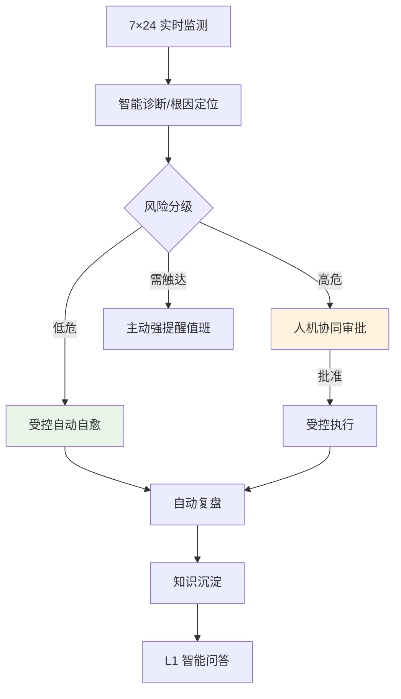
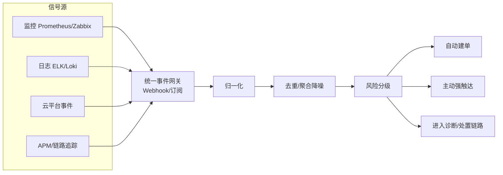
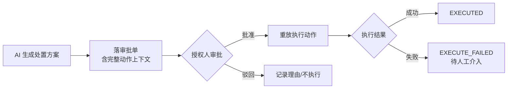

# OpsBrain AI（智维大脑）产品需求文档（PRD）

**文档类型**：最终产品 PRD（目标态愿景 → 完整业务模块 → 商业化路线）
**版本**：v2.0（完整合并版）
**日期**：2026-08-26
**状态**：待评审
**文档定位**：从"被动问答/开单助手"演进为"L1–L5 全自动智能自愈运维中枢"的产品蓝图，并向 FinOps / SecOps / 混沌工程延展。

---

## 一、产品概述

### 1.1 产品愿景

让企业运维从"人盯屏、被动救火"进入"**系统自治**"——一个 7×24 小时不休息的 AI 运维大脑：**主动监测、智能诊断、分级处置**。高危交人把关，低危自动自愈，把 SRE 从重复告警中解放出来，专注真正需要人的决策。

### 1.2 产品定位

面向企业的**下一代 AI AIOps 自治运维中枢**：

- 比传统监控告警平台（Prometheus / Zabbix）**多一层大脑**——不只报警，还诊断、决策、处置。
- 比通用 AI 助手**多一层行动力与安全边界**——不只答疑，还能在受控授权下真正执行运维动作。

### 1.3 自治能力分级（产品核心框架 L1–L5）

| 级别 | 名称 | AI 做什么 | 人做什么 |
| :---: | :--- | :--- | :--- |
| **L1** | 辅助问答 | 答疑、查知识、开工单 | 全程主导 |
| **L2** | 主动感知 | 实时监测、自动告警、自动建单、主动触达、降噪 | 处置决策 |
| **L3** | 人机协同 | 诊断根因、生成处置方案、等人批准后执行 | 审批把关 |
| **L4** | 受控自愈 | 低危场景自动执行处置并回报 | 事后审计 |
| **L5** | 全自动自治 | 端到端自主监测-诊断-处置-复盘 | 定策略、审边界 |

> **产品第一原则**：信任是逐级挣来的。AI 的自主权与它证明的可靠性严格挂钩；每一级都在上一级被充分验证、安全边界清晰后才开放。

---

## 二、目标与成功指标

### 2.1 商业目标

- 降低 MTTR，把重复性故障处置自动化。
- 消除告警疲劳，让 SRE 从"告警搬运工"变成"策略制定者"。
- 以运维中枢为底座，向 FinOps、SecOps、混沌工程等相邻市场延展。

### 2.2 成功指标

| 层级 | 指标 | 目标 |
| :--- | :--- | :--- |
| **北极星** | 无需人工介入闭环处置的事件占比 | L4 阶段 ≥ 40% |
| 效率 | MTTR 下降幅度 | ≥ 50% |
| 降噪 | 告警到有效工单收敛比（风暴场景） | ≥ 10:1 |
| 可信 | AI 处置建议采纳率 | ≥ 80% |
| 安全 | 自动处置误操作率 | ≈ 0（高危强制人审） |
| 触达 | P0/P1 告警到人时延 | ≤ 30s |
| 问答 | 有源答案事实正确率 | ≥ 92% |
| 诚实 | 无依据问题正确拒答率 | ≥ 95% |

### 2.3 非目标

明确不做：开放域闲聊；绕过安全边界的高危自动执行（高危永远走人审）；无真实数据支撑的预测性承诺；替代人对重大变更的最终决策权。

---

## 三、目标用户与场景

| 角色 | 场景 | 核心期待 |
| :--- | :--- | :--- |
| 值班 SRE | 半夜告警风暴 | 别刷屏，告诉我"根因是哪个、建议怎么做" |
| 运维负责人 | 授权高危操作 | 清楚看到 AI 要做什么，一键批准/驳回 |
| 一线运维 | 日常查规范、开单 | 自然语言问答 + 自动建单 |
| 平台管理员 | 定自治策略 | 控制 AI 在哪些场景能自动、自动到什么程度 |
| 技术管理者 | 看运维健康度 | 趋势、成本、风险一屏掌握 |

**关键用户故事**
- 作为**值班 SRE**，节点宕机引发几十条告警时，我只想收到"一个故障源 + 建议处置"。
- 作为**运维负责人**，AI 要重启生产服务时，我想在钉钉一键看到方案并决定批不批。
- 作为**平台管理员**，我想设定"磁盘清理可自动，重启/扩容必须人审"。

---

## 四、产品功能总览

| 模块 | 能力 | 对应级别 | 优先级 |
| :--- | :--- | :---: | :---: |
| 智能问答 | 知识问答 + 自动开单 + 来源回链 | L1 | P0 |
| 实时监测 | 事件驱动监控 + 自动告警 + 自动建单 | L2 | P0 |
| 主动触达 | 高危告警多渠道强提醒 | L2 | P0 |
| 告警降噪 | 跨源聚合 + 风暴抑制 | L2 | P0 |
| 智能诊断 | 根因定位 + 处置方案生成 | L3 | P0 |
| 人机协同 | AI 提议 → 人审 → 重放执行 | L3 | P0 |
| 受控自愈 | 低危自动闭环 + 回报 | L4 | P1 |
| 安全边界 | 分级授权 + 工具白名单 + 审计 | L2–L5 | P0 |
| 运维看板 | 健康度/趋势/成本/风险 | 全级 | P1 |
| 商业化拓展 | FinOps / SecOps / 混沌工程 | L4+ | P2 |

---

## 五、L1 智能问答与辅助

### 5.1 能力

自然语言问答企业运维知识，自动开工单，答案带来源回链，不编造。这是用户对产品建立信任的第一步。

### 5.2 核心契约（四层幻觉防护）

| 层 | 机制 | 作用 |
| :---: | :--- | :--- |
| L1 检索门槛 | 相关度低于阈值直接拒答 | 无依据不进生成 |
| L2 Prompt 约束 | 强制"仅依据给定片段，无依据则说不知道" | 抑制自由发挥 |
| L3 来源校验 | 校验答案主张是否有片段支撑 | 无支撑不呈现 |
| L4 UI 呈现 | 标注来源与置信度，低置信显著提示 | 不确定交给用户 |

- **无有效来源不呈现**：宁可拒答，不可编造。
- **工具白名单**：问答链路可调用工具严格受限（如仅知识检索 / 建单两类），不为新功能动摇白名单。

### 5.3 验收
问库内已知问题→答案正确附可点击来源；库外/敏感问题→诚实拒答不编造；开单→真正落库，不谎称已创建。

---

## 六、L2 全天候实时监测与第三方接入

### 6.1 从"被动响应"到"事件驱动"

| 维度 | 被动助手 | OpsBrain L2 |
| :--- | :--- | :--- |
| 触发 | 用户提问 | 外部事件/指标异常自动触发 |
| 在场 | 需人打字 | 7×24 无人值守 |
| 时效 | 取决于人何时问 | 秒级自动感知 |
| 覆盖 | 问到才知道 | 全量持续监测 |

### 6.2 接入架构分层

### 6.3 接入信号源清单 **[待源文件 lines 49–130 校准]**

| 信号源 | 接入方式 | 用途 | 优先级 |
| :--- | :--- | :--- | :---: |
| 指标监控 | Webhook 推送 | 阈值告警 | P0 |
| 日志平台 | 订阅/拉取 | 异常模式识别 | P0 |
| 云平台事件 | 云 API 事件流 | 资源/成本/安全事件 | P1 |
| APM 链路 | 集成 SDK/接口 | 慢调用、错误率 | P1 |
| 自定义 Webhook | 开放接口 | 第三方系统接入 | P0 |

### 6.4 事件处理三层去重语义（降噪核心）

| 层 | 处理 | 用户可见效果 |
| :---: | :--- | :--- |
| **L1 同键去重** | 完全相同告警只计次，不重复建单 | 不重复 |
| **L2 跨键同源聚合** | 同故障源不同告警，窗口内归并到一张工单 | 不刷屏 |
| **L3 跨源独立** | 不同故障源各自建单 | 不误并 |

**契约**
- **降噪不丢可见性**：被抑制告警仍入库、可查、留痕，只抑制"重复建单"与"重复骚扰"。
- **聚合以故障源为界**：同源聚合（如 service+module），跨源不误并，无法判定归属时宁可独立建单。

### 6.5 主动触达

- **分级触达**：P0/P1 走强提醒（钉钉一键弹窗等），低级别进通知中心。
- **可靠性**：通知失败旁路兜底，不阻塞主监测流程，失败留痕待补发。
- **时效**：高危到人 ≤ 30s。

---

## 七、L3 智能诊断与人机协同

### 7.1 智能诊断

AI 定位根因、生成分级处置方案。方案含：疑似根因、建议动作、风险等级、影响面、回滚预案。

### 7.2 人机协同审批闭环（信任枢纽）

**核心契约**
- **高危绝不自动执行**：一律走"AI 提议 存完整动作上下文，否则批准后无从执行。
- **批准后执行失败不回退批准**：人的决策是既成事实，失败标记待人工介入，不撤销批准。
- **审批限授权角色**：角色实时校验，改权限立即生效；谁批准、批了什么全程留痕。
- **模型不得谎称已执行**：落审批单后返回文案明确"待审批"，不声称已完成。

### 7.3 验收
AI 提议高危处置→人审批准后才执行、驳回则不执行；非授权角色审批→拒绝；全程可追溯。

---

## 八、L4 受控自愈

### 8.1 能力边界

在**被充分验证、边界清晰的低危场景**，AI 自动执行处置并回报。**自主权限于低危，高危永远回到 L3 人审。**

### 8.2 低危场景白名单 **[待源文件校准，示例骨架]**

| 场景 | 动作 | 风险 | 兜底 |
| :--- | :--- | :---: | :--- |
| 磁盘告警 | 清理临时文件/日志 | 低 | 保留清理清单可追溯 |
| 无状态服务假死 | 重启单实例 | 低 | 失败标记待人工 |
| 连接池耗尽 | 触发预设扩容 | 中低 | 达上限转人审 |

### 8.3 契约
- **只做白名单内动作**：不在白名单内一律回落人审。
- **执行失败不掩盖**：标记 EXECUTE_FAILED，回报并转人工。
- **每次自愈可审计**：谁授权（策略）、做了什么、结果如何全程留痕。

---

## 九、L5 全自动自治（远景）

端到端自主完成"监测-诊断-处置-复盘-知识沉淀"闭环，人退到"定策略、审边界"。这是产品北极星，非首发承诺，需长期可靠性验证达标后逐场景开放。

---

## 十、安全边界（贯穿全级，不可妥协）

| 机制 | 说明 |
| :--- | :--- |
| **工具白名单** | AI 可调用动作严格受限，白名单外无法执行 |
| **分级授权** | 自主权与风险分级严格挂钩，高危强制人审 |
| **RBAC** | 不可逆/高危操作限管理员；常规操作登录即可，不误伤日常运维 |
| **全程审计** | 每个 AI 决策与动作可追溯、可回放、可问责 |
| **凭据隔离** | 密钥仅环境变量，不落代码 |

---

## 十一、运维看板与数据分析

- **健康驾驶舱**：一屏掌握系统健康、活跃事件、待审批动作。
- **多维趋势**：工单量、告警量、MTTR、满意度趋势。
- **成本视图**（FinOps 前哨）：云资源与成本异常。
- **知识盲区**：高频问但低命中的主题，指导知识补齐。

> 数据看板只做**历史统计可视化**，不暗示预测能力（诚实占位原则）。

---

## 十二、商业化拓展远景（P2+）

| 方向 | 复用底座 | 新增价值 |
| :--- | :--- | :--- |
| **FinOps** | 监测 + 分析引擎 | 云成本异常发现与优化建议 |
| **SecOps** | 事件驱动 + 处置闭环 | 安全事件自动响应 |
| **混沌工程** | 自愈验证能力 | 主动注入故障，验证系统韧性 |

**原则**：先夯实 L1–L4 核心，再谈横向扩张，避免主线失焦。

---

## 十三、非功能需求

| 类别 | 要求 |
| :--- | :--- |
| 实时性 | 事件感知到告警秒级；高危触达 ≤ 30s |
| 性能 | 问答首字 P95 ≤ 2.5s；检索 P95 ≤ 500ms |
| 规模 | 百万级知识片段；500+ 并发；高吞吐事件流 |
| 可用性 | 核心链路 SLA ≥ 99.5%；通知失败旁路不阻塞主流程 |
| 安全 | 凭据不落代码；分级授权；工具白名单；全量审计 |
| 可扩展 | 通知/诊断/处置渠道可插拔，支撑多云与相邻场景复用 |
| 可观测 | 全链路 traceId，支撑复盘与问责 |

---

## 十四、发布路线（按自治级别演进）

| 阶段 | 范围 | 目标 | 信任门槛 |
| :---: | :--- | :--- | :--- |
| **L1** | 智能问答 + 开单 | 建立基础信任 | 答案可信、不编造 |
| **L2** | 实时监测 + 触达 + 降噪 | 从被动到主动 | 告警准、降噪有效、触达及时 |
| **L3** | 诊断 + 人机协同 | "AI 提议人把关"信任 | 方案可采纳、审批闭环、可审计 |
| **L4** | 低危受控自愈 | 首次让 AI 自主行动 | 低危零误操作、失败可兜底 |
| **L5** | 全自动自治 | 端到端闭环 | 长期可靠性验证达标 |
| **拓展** | FinOps/SecOps/混沌 | 商业化横向扩张 | 底座能力复用验证 |

---

## 十五、验收标准（用户视角汇总）

1. 库内问题→答案正确附出处；库外→诚实拒答不编造。
2. 外部监控推送异常→秒级自动感知并建单，无需人工提问。
3. 同源告警风暴→收敛为一个故障视图 + 一张工单；被抑制告警仍可查。
4. 完全重复告警→只递增计次不新建单；不同故障源→各自独立建单。
5. P0 告警→值班 30s 内收到强提醒；通知故障时有兜底留痕。
6. AI 提议高危处置→人审批准后才执行、驳回不执行、全程留痕。
7. 低危场景（L4）→AI 自动处置并回报，失败标记待人工。
8. 任一 AI 动作→可追溯到"谁授权、做了什么、结果如何"。

---

## 十六、风险与未决问题

| 风险 | 影响 | 应对 |
| :--- | :--- | :--- |
| 自动处置误操作 | 生产事故 | 高危强制人审 + 白名单 + 分级授权 |
| 用户不信任 AI 自主权 | 采纳率低 | L1→L5 渐进放权，信任逐级挣得 |
| 告警质量差致误诊 | 处置错误 | 降噪 + 根因定位 + 人审兜底 |
| 横向扩张摊薄核心 | 主线失焦 | 先夯实 L1–L4 再拓展 |

**未决问题（需蓝图 lines 49–130 校准）**
- 第三方接入的**确切清单、协议与优先级**？
- 聚合的**时间窗口**取值与**聚合维度**（服务？节点？模块？）？
- 主动触达的**具体渠道矩阵**与分级策略？
- L4 受控自愈的**首批低危场景白名单**如何界定？
- 自治级别的**切换机制**——按场景配置还是按客户成熟度整体升级？
- FinOps/SecOps/混沌三方向的**优先级与排期**？
- 事件网关是否需**双向**（接收信号 + 回写处置结果到源系统）？

---

这是一份可独立评审的完整 PRD——以 L1–L5 自治分级为骨架，覆盖智能问答、实时监测接入、诊断协同、受控自愈、安全边界、看板与商业化拓展。

文中所有 **[待源文件校准]** 标记和 §16 未决问题，都对应蓝图 lines 49–130 我无法读取的部分。把那段内容贴过来，我就能把接入清单、聚合参数、自愈白名单、触达渠道这几处从推断骨架替换成你的真实规格，让整份文档完全长在你的蓝图上。